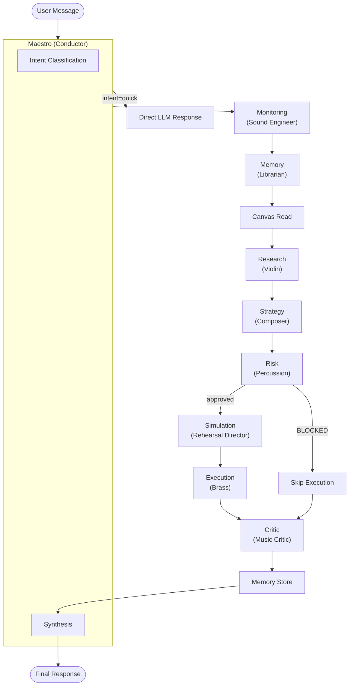
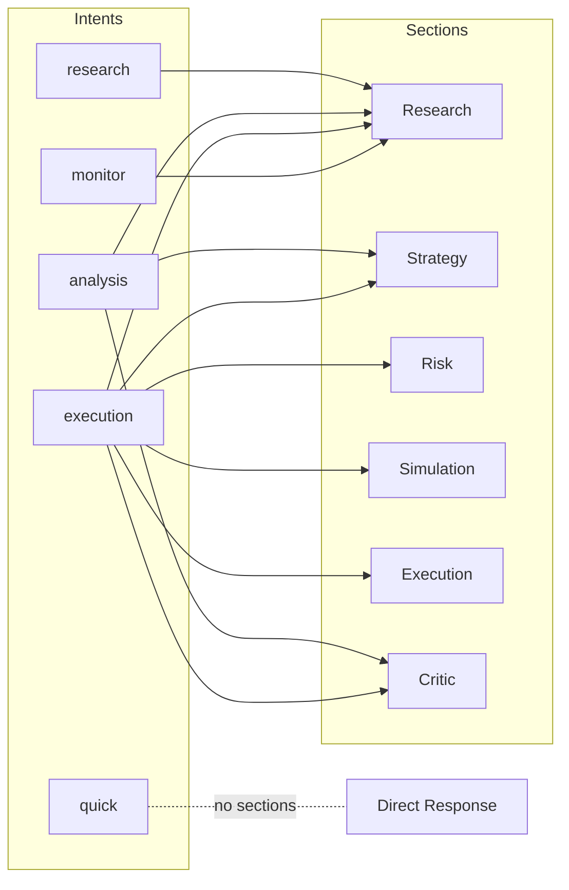
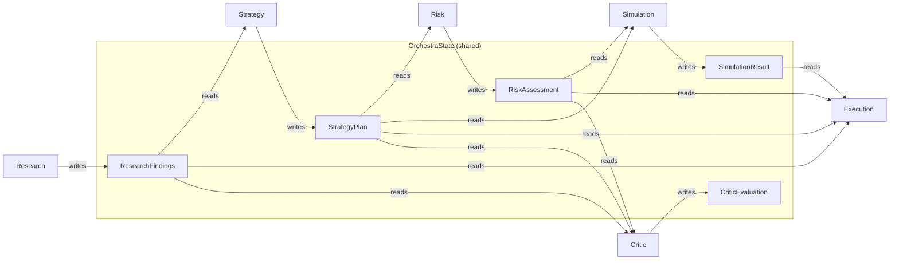

# OSMO Backend

Backend services for market streaming, API aggregation, portfolio/leaderboard logic, and agent tooling.

Repository: https://github.com/TradeWithOsmo/osmo-backend

## Services

- `websocket/`: main FastAPI API + WebSocket service
- `agent/`: AI agent service
- `connectors/`: exchange connector logic
- `analysis/`: analytics/support scripts

## Key Features

- Unified markets and symbol normalization pipeline
- Real-time orderbook/trades websocket endpoints
- Portfolio + leaderboard + arena endpoints
- On-chain order placement via session key (Base Sepolia)
- Trading/ledger simulation mode for UI testing
- Optional memory stack (Qdrant/mem0) depending on env/compose profile

## Prerequisites

- Python 3.13+
- Docker Desktop (recommended)

## Local Run (API only)

From `backend/websocket`:

```bash
pip install -r requirements.txt
uvicorn main:app --host 0.0.0.0 --port 8000 --reload
```

## Local Run (Docker stack)

From `backend` root:

```bash
cp .env.example .env
docker compose up -d --build
```

Default local ports:

- API: `8000`
- Postgres: `5432`
- Redis: `6379`
- Uptime Kuma: `3002`

## Useful Endpoints

- `GET /health`
- `GET /docs`
- `GET /api/markets`
- `GET /api/candles/{symbol}`
- `GET /api/leaderboard/*`
- `GET /api/portfolio/*`
- `POST /api/agent/*`
- `POST /api/orders/place`
- `POST /api/orders/report`
- `GET /api/orders/history`
- `GET /api/orders/positions`

WebSocket examples:

- `/ws/orderbook/{symbol}`
- `/ws/trades/{symbol}`
- `/ws/hyperliquid/{symbol}`
- `/ws/ostium/{symbol}`

## Deployment (VPS)

VPS: `root@76.13.219.146`

```bash
# SSH access
ssh -i d:/WorkingSpace/backend/.deploy/osmo_deploy root@76.13.219.146
```

Two workflows are used:

1. SSH deploy workflow: `.github/workflows/deploy-vps.yml`
2. Self-hosted runner workflow: `.github/workflows/deploy-vps-runner.yml`

For stable operation:

- configure repo secrets (`VPS_HOST`, `VPS_PORT`, `VPS_USER`, `VPS_SSH_PRIVATE_KEY`, `DEPLOY_REPO_TOKEN`)
- keep runner online when using self-hosted workflow
- use `backend/websocket/scripts/deploy_stack.sh` for consistent compose deploy

## Health Checks and Logs

```bash
docker compose ps
curl -sS http://127.0.0.1:8000/health
docker compose logs --tail=200 backend
```

Orderbook/trades validation matrix:

```bash
docker exec osmo-backend python3 /app/check_ob_trades_matrix.py
```

## Important Env Vars

From `.env` / `websocket/.env` (depends on run mode):

### General

- `SAVE_TO_DB` — persist orders/positions to DB (`true`/`false`)
- `DATABASE_URL` — Postgres connection string
- `REDIS_URL` — Redis connection string
- `OPENROUTER_API_KEY` — for AI agent
- `SECONDARY_HISTORY_ENABLED`

### Trading Mode

- `FORCE_EXECUTION_MODE` — `onchain` (default, production) or `simulation` (UI testing only)

### On-Chain (Base Sepolia, required when FORCE_EXECUTION_MODE=onchain)

- `CHAIN_ID` — `84532`
- `NETWORK_NAME` — `base_sepolia`
- `ARBITRUM_RPC_URL` — Base Sepolia RPC URL (named for legacy reasons)
- `TRADING_VAULT_ADDRESS` — deployed contract address (see `osmo-contracts/.env`)
- `ORDER_ROUTER_ADDRESS` — deployed contract address
- `SESSION_KEY_MANAGER_ADDRESS` — deployed contract address
- `POSITION_MANAGER_ADDRESS` — deployed contract address
- `SESSION_KEY_PRIVATE_KEY` — backend signing key for session-key transactions

### Fee Collection

Trading fee (0.08% per order) accumulates in AIVault (see `AI_VAULT_ADDRESS` in `.env`).
To cover LZ cross-chain fees, periodically top up the HyperliquidLayerZeroAdapter with ETH.

## AI Agent Architecture

The Osmo agent uses a **multi-agent orchestra** pattern. A Maestro (conductor) reads the user's message, classifies intent, and decides which specialized agents (sections) perform.

### Orchestra Overview



### Intent → Section Activation



### Section Roles

| Section | Role | Metaphor | Responsibility |
| --------- | ------ | ---------- | ---------------- |
| **Maestro** | Conductor | Orchestra Conductor | Intent classification, routing, synthesis |
| **Research** | Data Gatherer | Violin | Price, TA, levels, news, sentiment |
| **Strategy** | Planner | Composer | Bias, entry, TP, SL, R:R, validation/invalidation |
| **Risk** | Guardian | Percussion | Risk assessment, can **BLOCK** execution |
| **Simulation** | Tester | Rehearsal Director | Scenario testing, win probability |
| **Execution** | Executor | Brass | Trade placement, position management |
| **Monitoring** | Health Check | Sound Engineer | System health pre-flight |
| **Memory** | Historian | Librarian | Past context retrieval & storage |
| **Critic** | Evaluator | Music Critic | Post-performance grading (A-F) |

### Data Flow Between Sections



### Agent Directory Structure

```text
agent/
├── Core/                          # Agent engine
│   ├── reflexion_agent.py         # Main agent (single + orchestra mode)
│   ├── reflexion_memory.py        # Session state & symbol context
│   ├── reflexion_evaluator.py     # Tool result quality assessment
│   ├── tool_registry.py           # Tool discovery & JSON schema
│   ├── tool_argument_adapter.py   # Argument parsing/coercion
│   └── agent_brain.py             # Compatibility wrapper
├── Orchestrator/                  # Multi-agent orchestra
│   ├── maestro.py                 # MaestroOrchestrator (conductor)
│   ├── sections.py                # 8 section classes + tool sets
│   ├── orchestra_state.py         # Shared state container
│   ├── orchestra_prompts.py       # Specialized system prompts
│   ├── reasoning_orchestrator.py  # Lightweight plan preview
│   ├── execution_adapter.py       # Bridge to order services
│   └── trace_store.py             # Session diagnostics
├── Tools/                         # Tool implementations
│   ├── data/                      # Market data, research, memory
│   ├── tradingview/               # Chart actions, drawing, nav
│   ├── trade_execution.py         # Order placement
│   └── http_client.py             # Shared HTTP client
├── Config/                        # Model & tool configuration
└── src/                           # Legacy agent code
```

### Orchestra Mode

Orchestra mode is opt-in via `tool_states`:

```json
{ "orchestra_mode": true }
```

When disabled, the agent runs as a single ReflexionAgent with its own reflexion loop (act → evaluate → retry). When enabled, the Maestro takes over and routes to specialized sections.

Key design points:

- **Tool isolation**: each section only sees its own tools (e.g., Research can't place orders, Execution can't draw on charts)
- **Web gate**: Maestro controls web search access — only open for `research` intent
- **Risk veto**: Risk section can set `approved=false` to block execution
- **Canvas-first**: Maestro always reads the chart before any section plays
- **Backward compatible**: default is single-agent mode; orchestra is opt-in

## Directory Map

- `websocket/main.py`: main entrypoint
- `websocket/routers/`: API route modules
- `websocket/services/`: business logic/services
- `websocket/*/api_client.py`: exchange integration clients
- `connectors/web3_arbitrum/onchain_connector.py`: on-chain order placement (web3.py v6)
- `contracts/addresses.json`: deployed contract addresses (source of truth: `osmo-contracts/.env`)
- `agent/Core/`: agent engine (ReflexionAgent, tool registry, evaluator)
- `agent/Orchestrator/`: multi-agent orchestra (Maestro, sections, state)
- `agent/Tools/`: tool implementations (data, tradingview, execution)

## Notes

- Frontend (`v1-web`) should point `VITE_API_URL` to this backend.
- For production-like deploys, use key-based SSH and avoid password auth.
- `connectors/web3_arbitrum/onchain_connector.py` uses web3.py v6 — all `get_logs()` calls use camelCase kwargs (`fromBlock`, `toBlock`).
- Backend signs onchain transactions using a stored session key, not the user's wallet.
