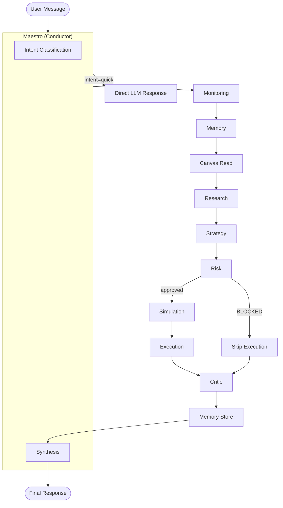

# Osmo Backend

Market streaming, API aggregation, portfolio/leaderboard, and AI agent services.


---

Repository: https://github.com/TradeWithOsmo/osmo-backend

## Services

- `websocket/`: main FastAPI API + WebSocket service
- `agent/`: AI agent (multi-agent orchestra — Maestro, Research, Strategy, Risk, Execution)
- `connectors/`: exchange connector logic
- `analysis/`: analytics/support scripts

## Key Features

- Unified markets and symbol normalization pipeline
- Real-time orderbook/trades websocket endpoints
- Portfolio + leaderboard + arena endpoints
- On-chain order placement via session key (Base Sepolia)
- Trading/ledger simulation mode for UI testing
- Optional memory stack (Qdrant/mem0) depending on env/compose profile

## Prerequisites

- Python 3.13+
- Docker Desktop (recommended)

## Setup

```bash
cp .env.example .env
cp websocket/.env.example websocket/.env
# Fill in API keys and contract addresses
```

## Local Run (API only)

From `websocket/`:

```bash
pip install -r requirements.txt
uvicorn main:app --host 0.0.0.0 --port 8000 --reload
```

## Local Run (Docker stack)

From repo root:

```bash
docker compose up -d --build
```

Default local ports:

| Service | Port |
|---|---|
| API | `8000` |
| Postgres | `5432` |
| Redis | `6379` |
| Uptime Kuma | `3002` |

## Useful Endpoints

```
GET  /health
GET  /docs
GET  /api/markets
GET  /api/candles/{symbol}
GET  /api/leaderboard/*
GET  /api/portfolio/*
POST /api/agent/*
POST /api/orders/place
POST /api/orders/report
GET  /api/orders/history
GET  /api/orders/positions
```

WebSocket:

```
/ws/orderbook/{symbol}
/ws/trades/{symbol}
/ws/hyperliquid/{symbol}
/ws/ostium/{symbol}
```

## Deployment (VPS)

Uses GitHub Actions workflows:

1. `deploy-vps.yml` — SSH deploy
2. `deploy-vps-runner.yml` — self-hosted runner

Required repo secrets: `VPS_HOST`, `VPS_PORT`, `VPS_USER`, `VPS_SSH_PRIVATE_KEY`, `DEPLOY_REPO_TOKEN`

Deploy script: `websocket/scripts/deploy_stack.sh`

## Health Checks and Logs

```bash
docker compose ps
curl -sS http://127.0.0.1:8000/health
docker compose logs --tail=200 backend
docker exec osmo-backend python3 /app/check_ob_trades_matrix.py
```

## Important Env Vars

See `websocket/.env.example` for full reference. Key variables:

### General

| Variable | Description |
|---|---|
| `SAVE_TO_DB` | Persist orders/positions to DB (`true`/`false`) |
| `DATABASE_URL` | Postgres connection string |
| `REDIS_URL` | Redis connection string |
| `FORCE_EXECUTION_MODE` | `onchain` (production) or `simulation` (UI testing) |

### LLM Providers

| Variable | Description |
|---|---|
| `ALIBABA_API_KEY` | DashScope / Qwen models (primary) |
| `OPENROUTER_API_KEY` | OpenRouter (optional fallback) |
| `GROQ_API_KEY` | Groq (optional) |
| `GEMINI_API_KEY` | Gemini (used for embeddings) |

### On-Chain (required when `FORCE_EXECUTION_MODE=onchain`)

| Variable | Description |
|---|---|
| `CHAIN_ID` | `84532` (Base Sepolia) |
| `ARBITRUM_RPC_URL` | Base Sepolia RPC URL (legacy name) |
| `TREASURY_PRIVATE_KEY` | Session key for signing transactions |
| `TRADING_VAULT_ADDRESS` | From `osmo-contracts/.env` |
| `ORDER_ROUTER_ADDRESS` | From `osmo-contracts/.env` |
| `SESSION_KEY_MANAGER_ADDRESS` | From `osmo-contracts/.env` |
| `POSITION_MANAGER_ADDRESS` | From `osmo-contracts/.env` |

Trading fee (0.08% per order) accumulates in `AI_VAULT_ADDRESS`.
Top up `HYPERLIQUID_LZ_ADAPTER_ADDRESS` with ETH for LayerZero cross-chain fees.

## AI Agent Architecture

The Osmo agent uses a **multi-agent orchestra** pattern. A Maestro (conductor) reads the user's message, classifies intent, and routes to specialized sections.

### Orchestra Overview



### Section Roles

| Section | Role | Responsibility |
|---|---|---|
| **Maestro** | Conductor | Intent classification, routing, synthesis |
| **Research** | Data Gatherer | Price, TA, levels, news, sentiment |
| **Strategy** | Planner | Bias, entry, TP, SL, R:R |
| **Risk** | Guardian | Risk assessment, can block execution |
| **Simulation** | Tester | Scenario testing, win probability |
| **Execution** | Executor | Trade placement, position management |
| **Monitoring** | Health Check | System health pre-flight |
| **Memory** | Historian | Past context retrieval & storage |
| **Critic** | Evaluator | Post-performance grading (A–F) |

Orchestra mode is opt-in via `tool_states: { "orchestra_mode": true }`. Default is single-agent mode.

## Directory Map

```
websocket/main.py              # main entrypoint
websocket/routers/             # API route modules
websocket/services/            # business logic
connectors/                    # exchange integration clients
agent/Core/                    # ReflexionAgent, tool registry, evaluator
agent/Orchestrator/            # Maestro, sections, shared state
agent/Tools/                   # tool implementations (data, tradingview, execution)
contracts/addresses.json       # deployed contract addresses
```
