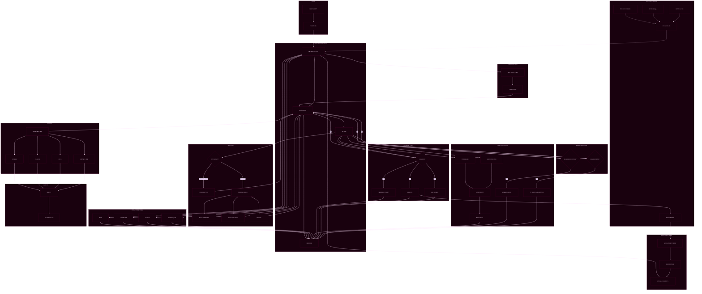

# OSMO Backend

Backend services for market data, trading simulation/on-chain execution routing, AI agent runtime, and arena/leaderboard computation.

Repository: https://github.com/TradeWithOsmo/osmo-backend

## Architecture

The backend repository contains multiple services:

- `websocket/` - main FastAPI service for APIs + WebSocket streams
- `agent/` - AI agent runtime and tools service
- `connectors/` - market/connectivity integrations
- `analysis/` - analytics scripts and support modules

## Mermaid Diagram



## Core Features

- Real-time market streaming (Hyperliquid and Ostium)
- Candle history API with fallback sources
- Portfolio, ledger, and leaderboard services
- Arena endpoints and points tracking
- TradingView command bridge/tooling endpoints
- AI chat/agent orchestration and tool execution
- Optional memory/knowledge stack (Qdrant, mem0, Inngest)

## Prerequisites

- Python 3.13+
- Docker Desktop (recommended for full stack)

## Quick Start (Docker, Recommended)

From `backend/websocket`:

```bash
cp .env.example .env
docker compose up -d --build
```

Default service ports:
- API: `8000`
- Postgres: `5432`
- Redis: `6379`
- Qdrant: `6333`
- Mem0 API: `8888`
- Inngest Dev: `8288`
- Upload UI: `8501`
- Langfuse Web (optional profile): `3001`

## Local Run (API Only)

From `backend/websocket`:

```bash
pip install -r requirements.txt
uvicorn main:app --host 0.0.0.0 --port 8000 --reload
```

## Local Run (Agent Service)

From `backend/agent`:

```bash
pip install -r requirements.txt
uvicorn src.main:app --host 0.0.0.0 --port 8001 --reload
```

## Important Environment Variables

Main API (`websocket/.env`):
- `SAVE_TO_DB`
- `DATABASE_URL`
- `REDIS_URL`
- `OPENROUTER_API_KEY`
- `AI_BILLING_ONCHAIN_ENABLED`
- `SECONDARY_HISTORY_ENABLED`
- `SESSION_HISTORY_DAYS`
- contract address vars (e.g. `TRADING_VAULT_ADDRESS`, `ORDER_ROUTER_ADDRESS`, etc.)

Use `websocket/.env.example` as baseline and replace all placeholder/secret values.

## Key Endpoints

- `GET /health`
- `GET /docs`
- `GET /api/markets`
- `GET /api/candles/{symbol}`
- `GET /api/leaderboard/*`
- `GET /api/portfolio/*`
- `POST /api/agent/*`
- `POST /api/tools/*`

WebSocket endpoints include:
- `/ws/hyperliquid/{symbol}`
- `/ws/ostium/{symbol}`
- `/ws/orderbook/{symbol}`
- `/ws/trades/{symbol}`

## Testing

Examples:

```bash
# API and service tests
pytest websocket/tests -q

# E2E tests
pytest websocket/tests/e2e -q
```

## Directory Guide

- `websocket/main.py` - primary app entrypoint
- `websocket/routers/` - REST route groups
- `websocket/services/` - business logic (ledger, order, portfolio, leaderboard, chat)
- `websocket/Ostium/`, `websocket/Hyperliquid/` - market adapters/data pipelines
- `agent/src/` - agent API, LLM factory, prompts, tools config
- `agent/Tools/` - runtime tool implementations

## Notes

- For frontend integration, set `VITE_API_URL` to this backend base URL.
- When running in Docker, confirm all dependent services are healthy before testing chat/tools flows.
