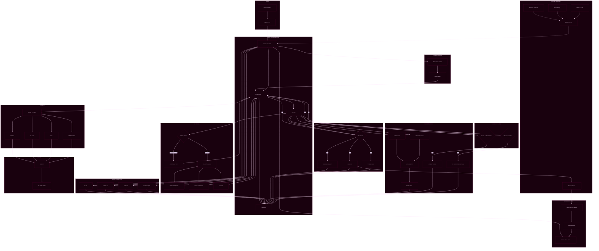

# OSMO Backend

Backend services for market data, trading simulation/on-chain execution routing, AI agent runtime, and arena/leaderboard computation.

Repository: https://github.com/TradeWithOsmo/osmo-backend

## Architecture

The backend repository contains multiple services:

- `websocket/` - main FastAPI service for APIs + WebSocket streams
- `agent/` - AI agent runtime and tools service
- `connectors/` - market/connectivity integrations
- `analysis/` - analytics scripts and support modules

## Mermaid Diagram



## Core Features

- Real-time market streaming (Hyperliquid and Ostium)
- Candle history API with fallback sources
- Portfolio, ledger, and leaderboard services
- Arena endpoints and points tracking
- TradingView command bridge/tooling endpoints
- AI chat/agent orchestration and tool execution
- Optional memory/knowledge stack (Qdrant, mem0, Inngest)

## Prerequisites

- Python 3.13+
- Docker Desktop (recommended for full stack)

## Quick Start (Docker, Recommended)

From `backend/websocket`:

```bash
cp .env.example .env
docker compose up -d --build
```

Default service ports:
- API: `8000`
- Postgres: `5432`
- Redis: `6379`
- Uptime Kuma: `3002` (container port `3001`)
- Qdrant: `6333`
- Mem0 API: `8888`
- Inngest Dev: `8288`
- Upload UI: `8501`
- Langfuse Web (optional profile): `3001`

## VPS Deployment Runbook (tradingapi)

Use this section for operational deployment to the production VPS.

Server connection:
- Public host: `ip.atlantic-server.com`
- SSH port: `13318`
- SSH user: `root`
- Project path: `/root/backend/websocket`
- Public API URL: `http://ip.atlantic-server.com:21724`
- Public WS URL: `ws://ip.atlantic-server.com:21724`

Security note:
- Do not store passwords or private keys in this repository.
- Keep current credentials in your team secret manager / secure channel.

### GitHub Actions Auto Deploy

Workflow file: `.github/workflows/deploy-vps.yml`

Trigger:
- Push to `main`
- Manual run from Actions tab (`workflow_dispatch`)

Required GitHub repository secrets:
- `VPS_HOST` -> `ip.atlantic-server.com`
- `VPS_PORT` -> `13318`
- `VPS_USER` -> `root`
- `VPS_SSH_PRIVATE_KEY` -> private key content for VPS login (recommended `ed25519`)
- `VPS_PASSWORD` -> optional fallback if key is not configured
- `DEPLOY_REPO_TOKEN` -> GitHub token with `repo` read access for this repository

Minimal one-time server preparation:

```bash
# On local machine, generate deploy key pair
ssh-keygen -t ed25519 -f ~/.ssh/osmo_deploy -C github-actions-deploy

# Add public key to VPS
ssh-copy-id -i ~/.ssh/osmo_deploy.pub -p 13318 root@ip.atlantic-server.com
```

After preparation:
- Put content of `~/.ssh/osmo_deploy` into GitHub secret `VPS_SSH_PRIVATE_KEY`
- Commit/push to `main` to auto-deploy
- Or run workflow manually and set `ref` input if you want a non-main branch/tag deploy

### Uptime Kuma (Self-Hosted Monitoring + Status Page)

Uptime Kuma is fully auto-bootstrapped by Docker Compose (no manual checklist in UI required).
The bootstrap container will:
- create admin account (first run only),
- create/update core monitors (API internal/public, TCP, Redis, Postgres),
- create/update a public status page,
- attach optional alert channels (Discord/Telegram/Webhook) if env vars are provided.

```bash
# 1) SSH into VPS
ssh -p 13318 root@ip.atlantic-server.com

# 2) Go to project path
cd /root/backend/websocket

# 3) Configure env (important: change default Kuma password)
cp .env.example .env
nano .env

# 4) Deploy full stack + monitoring bootstrap
sh scripts/deploy_stack.sh

# 5) Verify bootstrap result
docker compose logs --tail=200 uptime-kuma-bootstrap
```

Access:
- Local on VPS: `http://127.0.0.1:3002`
- Public UI (after panel port-forward): `http://<VPS_PUBLIC_IP>:<KUMA_PUBLIC_PORT>`
- Public status page: `http://<VPS_PUBLIC_IP>:<KUMA_PUBLIC_PORT>/status/<UPTIME_STATUS_PAGE_SLUG>`

Panel port-forward recommendation:
- Rule name: `UptimeKuma`
- Internal port: `3002`
- Protocol: `TCP`
- Public port example: `12830`

Idempotent re-run (safe any time):
```bash
cd /root/backend/websocket
docker compose run --rm uptime-kuma-bootstrap
```

### Deploy Steps (Backend API + Monitoring)

```bash
# 1) SSH into VPS
ssh -p 13318 root@ip.atlantic-server.com

# 2) Move to project
cd /root/backend/websocket

# 3) (Optional) sync latest code
# git pull origin main

# 4) Rebuild full stack + re-bootstrap Kuma monitors/status page
sh scripts/deploy_stack.sh

# 5) Check service status
docker compose ps
curl -sS http://127.0.0.1:8000/health
```

### Fast File Patch Deploy (without git pull)

From local machine (example for one file):

```bash
scp -P 13318 websocket/main.py root@ip.atlantic-server.com:/root/backend/websocket/main.py
ssh -p 13318 root@ip.atlantic-server.com "cd /root/backend/websocket && docker-compose up -d --build backend"
```

### Troubleshooting: `KeyError: 'ContainerConfig'`

Some VPS setups with legacy `docker-compose` can fail on recreate with:
`KeyError: 'ContainerConfig'`.

Use:

```bash
cd /root/backend/websocket
docker ps -a --filter name=osmo-backend -q | xargs -r docker rm -f
docker-compose up -d backend
docker-compose ps
```

### Market Stream Validation (Orderbook/Trades)

After deploy, validate stream consistency:

```bash
docker exec osmo-backend python3 /app/check_ob_trades_matrix.py
```

Useful tuning params:

```bash
docker exec \
  -e MAX_PER_SOURCE=20 \
  -e CHECK_CONCURRENCY=25 \
  -e WS_TIMEOUT_S=2.5 \
  -e WS_OPEN_TIMEOUT_S=2.5 \
  osmo-backend python3 /app/check_ob_trades_matrix.py
```

Interpretation:
- `OB OK`/`TR OK` means endpoint produced valid non-zero `px` + `sz`.
- `Timeout` means no valid payload within timeout window (not always an API crash).
- Some connectors are price-only or partial-depth by design (for example, no trades feed on certain sources).

### Hasil Test Terbaru (February 25, 2026)

Environment:
- VPS: `ip.atlantic-server.com`
- Container: `osmo-backend`

Run 1 (full canonical scan):

```bash
docker exec \
  -e MAX_PER_SOURCE=0 \
  -e CHECK_CONCURRENCY=25 \
  -e WS_TIMEOUT_S=2.5 \
  -e WS_OPEN_TIMEOUT_S=2.5 \
  osmo-backend python3 /app/check_ob_trades_matrix.py
```

| Source | Tested | OB OK | TR OK | Kesimpulan |
|---|---:|---:|---:|---|
| Aster | 146 | 146 | 146 | OB + TR konsisten |
| Hyperliquid | 224 | 12 | 12 | Parsial, sensitif burst/load |
| Lighter | 16 | 0 | 16 | Trades ada, orderbook belum |
| Ostium | 47 | 0 | 0 | Price feed only (tanpa OB/TR) |
| Vest | 164 | 164 | 0 | Orderbook ada, trades belum |

Run 2 (sample low concurrency, untuk kurangi efek burst):

```bash
docker exec \
  -e MAX_PER_SOURCE=20 \
  -e CHECK_CONCURRENCY=1 \
  -e WS_TIMEOUT_S=2.5 \
  -e WS_OPEN_TIMEOUT_S=2.5 \
  osmo-backend python3 /app/check_ob_trades_matrix.py
```

| Source | Tested | OB OK | TR OK |
|---|---:|---:|---:|
| Aster | 20 | 20 | 20 |
| Hyperliquid | 20 | 14 | 15 |
| Lighter | 16 | 0 | 16 |
| Ostium | 20 | 0 | 0 |
| Vest | 20 | 20 | 0 |

### Analisis & Fix (February 25, 2026)

| Source | Issue | Root Cause | Fix |
|---|---|---|---|
| Lighter | OB = 0 | `get_depth()`: (1) response nested under `order_book` key not always present; (2) level fields use `limit_price`/`amount` not `px`/`sz`; (3) `_market_id_map` empty on cold-start | Reworked `get_depth` to try flat layout first, then nested fallback; normalise all level fields to `{px, sz}` inside the client; auto-refresh market map on first call |
| Vest | TR = 0 | `get_recent_trades()` called `data.get("trades", [])` but Vest `/trades` returns a **raw JSON array**, not `{"trades": [...]}` — causing `AttributeError` | Fixed to detect `list` vs `dict` response; parse `price`/`qty` directly; derive side from sign of `qty`; return normalised `{px, sz, side, time, id}` |

Files changed:
- `websocket/Lighter/api_client.py` — `get_depth()` rewritten
- `websocket/Vest/api_client.py` — `get_recent_trades()` rewritten

## Local Run (API Only)

From `backend/websocket`:

```bash
pip install -r requirements.txt
uvicorn main:app --host 0.0.0.0 --port 8000 --reload
```

## Local Run (Agent Service)

From `backend/agent`:

```bash
pip install -r requirements.txt
uvicorn src.main:app --host 0.0.0.0 --port 8001 --reload
```

## Important Environment Variables

Main API (`websocket/.env`):
- `SAVE_TO_DB`
- `DATABASE_URL`
- `REDIS_URL`
- `OPENROUTER_API_KEY`
- `AI_BILLING_ONCHAIN_ENABLED`
- `SECONDARY_HISTORY_ENABLED`
- `SESSION_HISTORY_DAYS`
- contract address vars (e.g. `TRADING_VAULT_ADDRESS`, `ORDER_ROUTER_ADDRESS`, etc.)

Use `websocket/.env.example` as baseline and replace all placeholder/secret values.

## Key Endpoints

- `GET /health`
- `GET /docs`
- `GET /api/markets`
- `GET /api/candles/{symbol}`
- `GET /api/leaderboard/*`
- `GET /api/portfolio/*`
- `POST /api/agent/*`
- `POST /api/tools/*`

WebSocket endpoints include:
- `/ws/hyperliquid/{symbol}`
- `/ws/ostium/{symbol}`
- `/ws/orderbook/{symbol}`
- `/ws/trades/{symbol}`

## Testing

Examples:

```bash
# API and service tests
pytest websocket/tests -q

# E2E tests
pytest websocket/tests/e2e -q
```

## Directory Guide

- `websocket/main.py` - primary app entrypoint
- `websocket/routers/` - REST route groups
- `websocket/services/` - business logic (ledger, order, portfolio, leaderboard, chat)
- `websocket/Ostium/`, `websocket/Hyperliquid/` - market adapters/data pipelines
- `agent/src/` - agent API, LLM factory, prompts, tools config
- `agent/Tools/` - runtime tool implementations

## Notes

- For frontend integration, set `VITE_API_URL` to this backend base URL.
- When running in Docker, confirm all dependent services are healthy before testing chat/tools flows.
